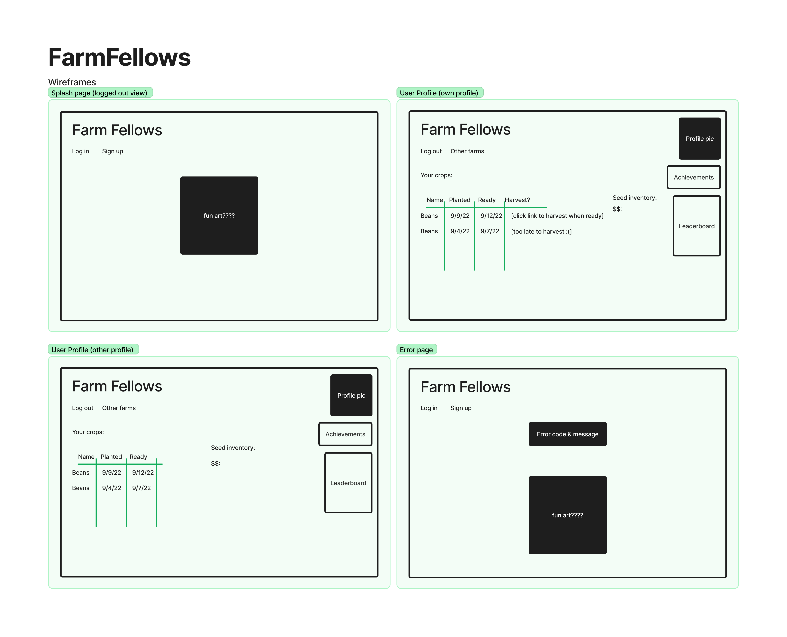
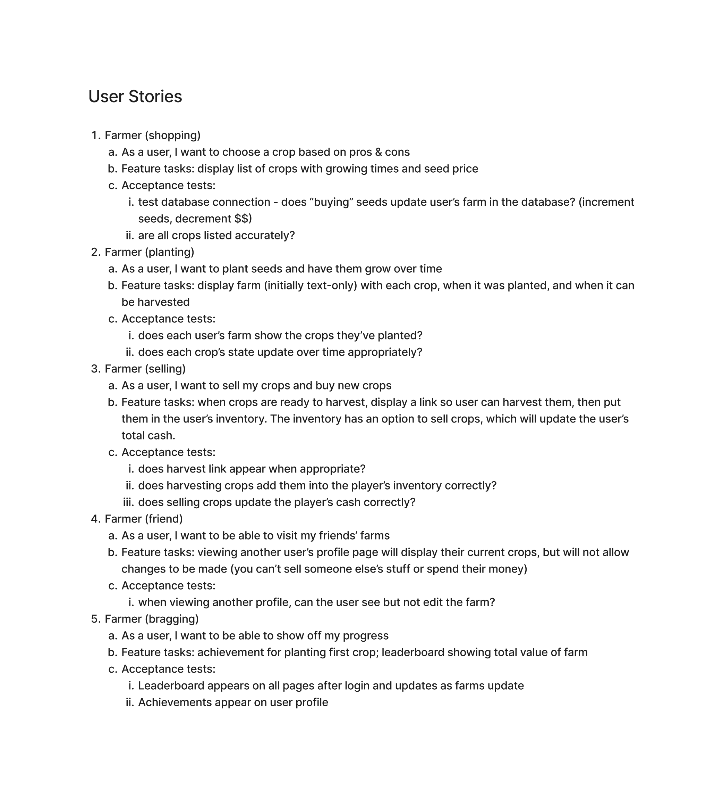
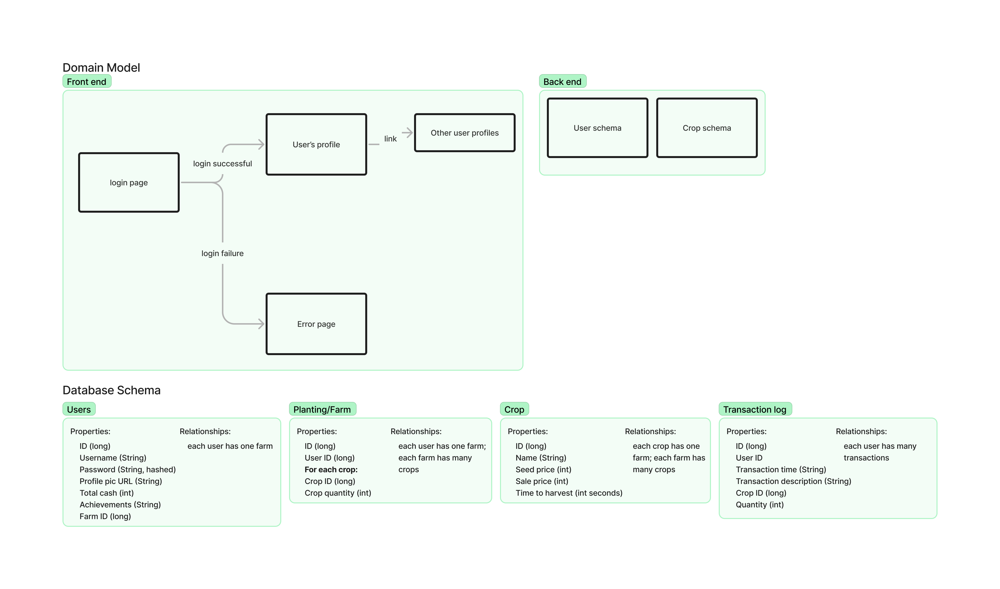

# 401 Project 

Team members: Joshua Frazer, Lucy Gelderloos, Rexie Esmeralda, Trevor Stephens

## Cooperation Plan

**What are the key strengths of each person on the team?**

- Josh - Great design principles
- Lucy - Design/ Frontend/ CSS / organization
- Rexie - Security/ backend / 
- Trevor - Backend/ being available/ troubleshooting

**How can you best utilize these strengths in the execution of your project?**
We have all the bases covered and we can simultaneosly complete aspects of the site.

**In which professional competencies do you each want to develop greater strength?**

- Josh - Utilizing tools/ Communication
- Lucy - Communication/ 
- Rexie - Agile proficiency/ getting results quicker
- Trevor -  Technical proficiency/ Confidence

**Knowing that every person in your team needs to understand all aspects of the project, how do you plan to approach the day-to-day work?**

Morning meeting to plan the day, going over pull requests together, discussing goals and accomplishments in the PR's with good comments. Set daily goals for each person to be sure everyone is on the same page and not getting stuck.

## Conflict Plan

**What will be your group’s process to resolve conflict, when it arises?**  

Bring up any issues in the group slack or talk to someone one-on-one if needed. Open lines of cummunication. Everyone is learning and be understanding of that. If anyone is having issues solving things alone we can use partner programming or sharing screens to figure it out together.  

**What will your team do if one person is taking over the project and not letting the other members contribute?**  
Let them know to delegate tasks more and that they're taking over a bit too much. It's a team effort.  

**How will you approach each other and the challenges of the project knowing that it is impossible for all members to be at the exact same place in understanding and skill level?** 

Everyone is learning and be understanding of that. If anyone is having issues solving things alone we can use partner programming or sharing screens to figure it out together. People choosing tasks that they are comfortable with, don't necessarily have to complete an equal amount.  

**How will you raise concerns to members who are not adequately contributing?**  

Offer to help or change the way were programming together. Don't call them out in the group setting, just offer to help out if you notice something or talk it over with the person.  

**How and when will you escalate the conflict if your resolution attempts are unsuccessful?**  

Team meeting/ intervention.

## Communication plan

**What hours will you be available to communicate?**  

All times in PST

- Josh - ALLDAY!!
- Lucy - 9am - 6pm 
- Rexie - 830am-6pm but always around
- Trevor - 830-6pm

**What platforms will you use to communicate (ie. Slack, phone …)?**  

Slack, Remo

**How often will you take breaks?**  

Every hour at least but not really any requirement.  

**What is your plan if you start to fall behind?**  

Adjust accordingly during stand up. Adjust MVP or features if need to be scoped down. Talk to Alex. Lean on eachothers strengths.

**How will you communicate after hours and on the weekend?**  

Send a message on slack, if there's no response it's too late probably.  

**What is your strategy for ensuring everyone’s voice is heard?**  

Bring up any concerns during the morning standup and adjust accordingly. Anything can also be brought up in slack group chat. Tell Josh if he talks too much.  

**How will you ensure that you are creating a safe environment where everyone feels comfortable speaking up?**  

Be kind to everyone and open to people's suggestions. Don't talk down.  

## Work Plan

**How you will identify tasks, assign tasks, know when they are complete, and manage work in general?**  

Use project management website.  

**What project management tool will be used?**  

Trello or Github Projects
https://trello.com/invite/b/GVUIYrxh/9a109727893d7f7d9771715144cd802a/farmfellows

**Presentation Deck**
https://docs.google.com/presentation/d/1LEAkuM6hGef3zZKBQoGHl-HN6qAicsh59zB--aeS3fI/edit?usp=sharing

**Schedule Presentation**
TBD
## Git Process

**What components of your project will live on GitHub?**  

The whole project codebase. Database and hosting will not be included on github

**How will you share the repository with your teammates?**  
We're in a github organization.  

**What is your Git flow?**  

We'll all make a branch for our features and we will merge to main during the morning standup.  

**Will you be using a PR review workflow?** If so, consider:
Yes, we will have to approve pull request by another member to avoid conflicts.
- **How many people must review a PR?**
 At least one reviewer.
- **Who merges PRs?**  
Anyone can as long as we all agree.
- **How often will you merge?**  
Every morning during review. as needed.  
- **How will you communicate that it’s time to merge?**
We have a set time or we can discuss if it's pertinent. as needed. 

## Presentation Prep  

Plan to have a dress rehearsal and plan out the presentation on thursday after our final merge.We will also create slides during this time.  

## Our pitch

To create a farming game that allows users to grow, collect and sell crops.  This game will be multiplayer so you can interact with other people's farms.

**What problem or pain point does it solve? a. Keep it high level without going into too much detail.**  

This game is for entertainment purposes so when you have freetime you can relax and tend to crops. Some socialization between other players.

**Minimum Viable Product (MVP) definition.
What is the minimum required for you to present on your demo day?**  

Present a game where you are able to view (through plain text) the state of crops and view other people's farm.  
**Possible tools**
- https://socket.io/
- Spring
- Java
**Alex Ideas and Questions**
- What happens when you stop playing?
- How is time used?
- model application so application can persist and stay up to date
**Issues**
- tracking relative time
- persistence
- games have a lot of logic

## Wireframe

## User Stories

## Domain Model & Database Schema

# Tutorial for setup

## What you will need first
- you will need to create pgadmin account tutorial found [here](https://www.pgadmin.org/docs/pgadmin4/development/getting_started.html)
- Google OAuth Account tutorial found [here](https://developers.google.com/identity/sign-in/web/sign-in)
- github OAuth Account found [here](https://docs.github.com/en/developers/apps/building-oauth-apps/creating-an-oauth-app)

**Step 1:** Navigate to https://github.com/teamJLRT/Farm-Fellows and clone the repo

**Step 2:** Open the newly cloned material in IntelliJ IDE

**Step 3:** Navigate through the data structure from src>main>resources>application.properties then comment in ` spring.config.import=file:env.properties`

**Step 4:** Create an env.properties file on the root directory which will store your login Credentials for GitHub and Google OAuth as well as Database credentials.
Your env.properties folder should mirror the following:

SPRING_DATASOURCE_URL=jdbc:postgresql://localhost:5432/`<Your database name>`  
replace information in <> with your information DO NOT INCLUDE <>

SPRING_DATABASE_USERNAME=Youruserinfo

SPRING_DATABASE_PASSWORD=yourpassword

GH_CLIENT_ID=info provided in gitub OAuth sign up

GH_CLIENT_SECRET=info provided by github OAuth signup

GOOGLE_CLIENT_ID=google ID provided during OAUth signup

GOOGLE_CLIENT_SECRET=client secret provided during OAuth signup

**Step 5:** navigate to FarmFellowsApplication
Src>main>java>FarmFellowsApplication and select the green play button to run the application
**Step 6:** you will need to open a web browser and navigate to `http://localhost:8080/` then enjoy

